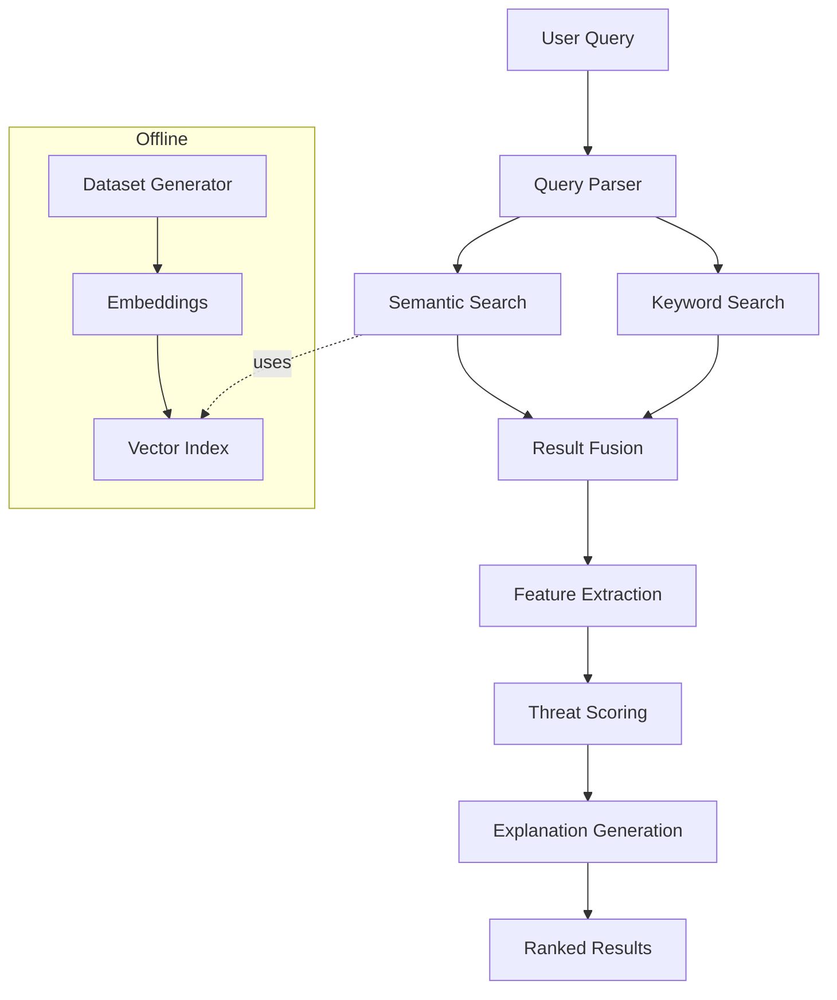

# 🛡️ Threat Hunting RAG System - Implementation Plan

## 📋 Executive Summary

### **What is the Task?**
Build a **Retrieval-Augmented Generation (RAG) system** for **phishing threat hunting** that can analyze email datasets through natural language queries and return ranked, explainable threat detections.

### **What Do We Want to Achieve?**
Create a production-ready system that:
- Processes natural language queries like *"Show me emails with urgent payment requests from new senders"*
- Combines keyword and semantic search for comprehensive threat detection
- Provides confidence scores and human-readable explanations for each threat
- Runs locally without external dependencies
- Responds in < 2 seconds for ~200 emails
- **Supports both CLI and REST API interfaces for different use cases**

### **🔌 Interface Options**

#### **Primary: REST API** 
- **Use Case**: Integration with SIEM systems, automated workflows, programmatic access
- **Output**: Structured JSON responses with full metadata  
- **Features**: Swagger documentation, batch endpoints, health checks, async processing
- **Authentication**: API key authentication + rate limiting
- **Priority**: **HIGH** - Main interface for production systems

#### **Secondary: CLI Interface**
- **Use Case**: Development, testing, manual threat hunting, debugging
- **Output**: Human-readable text + JSON option
- **Commands**: Single queries, interactive mode, batch processing  
- **Authentication**: None (local development tool)
- **Priority**: **MEDIUM** - Support interface for developers

### **Success Criteria (Definition of Done)**
✅ **Functional**: System processes 10+ example queries with accurate results  
✅ **Performance**: Query response time < 2 seconds  
✅ **Quality**: Explanations match detected threat indicators  
✅ **Code Quality**: Follows industry standards (see Code Quality Standards below)
✅ **Completeness**: All deliverables committed to GitHub  
✅ **Reproducible**: Runs locally with minimal setup  

---

## 🎯 Architecture Overview

### **🔁 High-Level Flow**
1. **Data Generation** – Create synthetic emails with phishing indicators
2. **Embedding Indexing** – Convert emails into semantic vectors  
3. **Retrieval Layer** – Perform keyword and semantic search
4. **Threat Scoring** – Calculate phishing likelihood via weighted signals
5. **Explanation Layer** – Generate concise natural-language justifications
6. **Interface** – CLI or API for user queries
7. **Iteration** – Refine searches based on results

### **📊 System Architecture**


---

## 🧱 **Technology Stack**

| Layer | Tool | Purpose |
|-------|------|---------|
| **Language** | Python 3.11+ | NLP, vector search, and RAG prototyping |
| **Data Generation** | faker, uuid | Create synthetic emails |
| **Data Processing** | pandas | Structure and filter dataset |
| **Embeddings** | sentence-transformers/all-MiniLM-L6-v2 | Local semantic embeddings |
| **Vector DB** | Chroma | Persistent local vector store |
| **Optional LLM** | gpt-4o-mini or Llama 3.1 8B | Generate explanations |
| **Config** | python-dotenv | Manage environment variables |
| **REST API** | FastAPI + uvicorn | Primary JSON API for production use |
| **CLI Interface** | argparse (optional) | Development and testing interface |
| **Tests** | pytest | Validate pipeline |
| **Docs** | Mermaid, Markdown | Visualize and document architecture |

---

## 📊 Code Quality Standards

### **1. Naming Conventions & Code Style**
- **PEP 8** compliance for all Python code
- **Descriptive names**: `ThreatScorer` not `TS`, `calculate_phishing_score()` not `calc()`
- **Constants**: `PHISHING_THRESHOLD = 0.7` (UPPER_CASE)
- **Classes**: `PascalCase` (EmailRetriever, ThreatAnalyzer)
- **Functions/variables**: `snake_case` (extract_features, threat_score)
- **Private methods**: `_internal_method()`
- **Type hints**: All functions must have input/output type annotations

### **2. Logging Strategy**
```python
import logging
logger = logging.getLogger(__name__)

# Structured logging levels:
logger.debug("Query preprocessing completed")      # Development debugging
logger.info("Processing query: {query}")          # Normal operations  
logger.warning("Low confidence score: {score}")   # Potential issues
logger.error("Failed to connect to vector DB")    # Errors that don't crash
logger.critical("System initialization failed")   # Fatal errors
```

### **3. Design Patterns & Architecture**

#### **3.1. Core OOP Principles**
- **Single Responsibility**: Each class has one clear purpose
- **Open/Closed**: Open for extension, closed for modification
- **Liskov Substitution**: Subclasses must be substitutable for base classes
- **Interface Segregation**: Use ABC (Abstract Base Classes) for contracts
- **Dependency Inversion**: Depend on abstractions, not concretions

#### **3.2. Essential Design Patterns**
```python
# Factory Pattern - Create retrievers dynamically
class RetrieverFactory:
    @staticmethod
    def create_retriever(retriever_type: str, **kwargs) -> BaseRetriever:
        if retriever_type == "keyword":
            return KeywordRetriever(**kwargs)
        elif retriever_type == "semantic":
            return SemanticRetriever(**kwargs)
        elif retriever_type == "hybrid":
            return HybridRetriever(**kwargs)
        else:
            raise ValueError(f"Unknown retriever type: {retriever_type}")

# Strategy Pattern - Interchangeable scoring algorithms
class ScoringStrategy(ABC):
    @abstractmethod
    def calculate_score(self, features: ThreatFeatures) -> float:
        pass

class WeightedScoringStrategy(ScoringStrategy):
    def __init__(self, weights: Dict[str, float]):
        self.weights = weights

# Builder Pattern - Complex pipeline construction
class PipelineBuilder:
    def __init__(self):
        self.retriever = None
        self.scorer = None
        self.explainer = None
    
    def with_retriever(self, retriever: BaseRetriever):
        self.retriever = retriever
        return self
    
    def with_scorer(self, scorer: ThreatScorer):
        self.scorer = scorer
        return self
    
    def build(self) -> ThreatHuntingPipeline:
        return ThreatHuntingPipeline(self.retriever, self.scorer, self.explainer)

# Repository Pattern - Data access abstraction
class EmailRepository(ABC):
    @abstractmethod
    def get_all_emails(self) -> List[Email]:
        pass
    
    @abstractmethod
    def get_email_by_id(self, email_id: str) -> Optional[Email]:
        pass

# Facade Pattern - Simplified API interface
class ThreatHuntingFacade:
    def __init__(self, config: Config):
        self.pipeline = self._build_pipeline(config)
    
    def hunt_threats(self, query: str) -> List[ThreatResult]:
        """Single method to perform complete threat hunting."""
        return self.pipeline.process_query(query)
```

#### **3.3. Architectural Patterns**
- **Layered Architecture**: Presentation → Business Logic → Data Access
- **Dependency Injection**: Components receive dependencies via constructors
- **Command Query Separation**: Separate read and write operations
- **Event-Driven**: Use observers for logging and monitoring

### **4. Error Handling & Resilience**
```python
# Custom exceptions for domain-specific errors
class ThreatHuntingError(Exception): pass
class EmbeddingError(ThreatHuntingError): pass  
class RetrievalError(ThreatHuntingError): pass

# Graceful degradation
try:
    semantic_results = semantic_retriever.search(query)
except RetrievalError:
    logger.warning("Semantic search failed, using keyword only")
    semantic_results = []
```

### **5. Documentation Standards**

#### **5.1. Docstrings (Required for all public functions/classes)**
```python
def calculate_threat_score(features: ThreatFeatures, weights: Dict[str, float]) -> float:
    """Calculate weighted phishing threat score.
    
    Args:
        features: Extracted threat indicators
        weights: Feature importance weights (must sum to 1.0)
        
    Returns:
        Threat score between 0.0 (safe) and 1.0 (high risk)
        
    Raises:
        ValueError: If weights don't sum to 1.0
        
    Example:
        >>> features = ThreatFeatures(urgent_language=0.8, new_sender=0.6)
        >>> weights = {"urgent_language": 0.7, "new_sender": 0.3}
        >>> calculate_threat_score(features, weights)
        0.74
    """
```

#### **5.2. Inline Comments (Strategic, not excessive)**
```python
def hybrid_search(self, query: str, top_k: int = 10) -> List[QueryResult]:
    # Step 1: Parallel search execution for performance
    keyword_results = self.keyword_retriever.search(query, top_k * 2)  # Get more candidates
    semantic_results = self.semantic_retriever.search(query, top_k * 2)
    
    # Step 2: Normalize scores to 0-1 range before fusion
    keyword_normalized = self._normalize_scores(keyword_results)
    semantic_normalized = self._normalize_scores(semantic_results)
    
    # Step 3: Weighted fusion using Reciprocal Rank Fusion (RRF)
    # RRF formula: score = sum(1/(rank + k)) where k=60 is standard
    fused_results = self._reciprocal_rank_fusion(
        keyword_normalized, 
        semantic_normalized,
        k=60  # Standard RRF parameter
    )
    
    return fused_results[:top_k]  # Return only requested number
```

#### **5.3. Comment Guidelines**
- **Explain WHY, not WHAT**: Code should be self-documenting for what it does
- **Complex algorithms**: Comment the approach and key formulas
- **Business logic**: Explain domain-specific decisions
- **Non-obvious choices**: Why this specific threshold/parameter?
- **TODOs**: Mark future improvements clearly
```python
# TODO: Implement BM25 scoring for better keyword relevance
# FIXME: Handle edge case where all weights are zero
# NOTE: This threshold was determined from empirical testing
PHISHING_THRESHOLD = 0.7  # Values above this are flagged as high-risk
```

#### **5.4. File-level Documentation**
```python
"""
Threat scoring module for phishing detection.

This module implements weighted aggregation of threat features to calculate
overall phishing likelihood scores. Uses configurable weights to balance
different risk indicators based on their importance.

Key classes:
    - ThreatScorer: Main scoring engine
    - ThreatFeatures: Feature container with validation
    
Usage:
    scorer = ThreatScorer(weights=PRODUCTION_WEIGHTS)
    score = scorer.calculate_score(extracted_features)
"""
```

### **6. Testing Standards**
- **Unit tests**: Test individual functions in isolation
- **Integration tests**: Test component interactions  
- **Mocking**: Mock external dependencies (file system, networks)
- **Fixtures**: Reusable test data
- **Parameterized tests**: Test multiple scenarios efficiently
- **Test coverage**: >80% line coverage, >90% for core logic

### **7. Configuration Management**
```python
# config.py - Centralized configuration with environment variables
import os
from dataclasses import dataclass
from typing import Optional
from pathlib import Path

@dataclass
class Config:
    # Model Configuration
    embedding_model: str = "sentence-transformers/all-MiniLM-L6-v2"
    model_cache_dir: str = "models/"
    
    # Data Paths
    vector_db_path: str = "data/chroma"
    email_dataset_path: str = "data/emails.csv"
    
    # Performance Settings
    phishing_threshold: float = 0.7
    max_results: int = 10
    batch_size: int = 32
    cache_ttl_seconds: int = 3600  # 1 hour cache
    
    # API Configuration (Optional)
    openai_api_key: Optional[str] = None
    openai_model: str = "gpt-4o-mini"
    
    # Logging
    log_level: str = "INFO"
    log_file: Optional[str] = None
    
    # Performance Tuning
    enable_query_cache: bool = True
    enable_embedding_cache: bool = True
    max_cache_size: int = 1000
    
    @classmethod
    def from_env(cls) -> 'Config':
        """Load configuration from environment variables."""
        return cls(
            # Model settings
            embedding_model=os.getenv('EMBEDDING_MODEL', cls.embedding_model),
            model_cache_dir=os.getenv('MODEL_CACHE_DIR', cls.model_cache_dir),
            
            # Paths
            vector_db_path=os.getenv('VECTOR_DB_PATH', cls.vector_db_path),
            email_dataset_path=os.getenv('EMAIL_DATASET_PATH', cls.email_dataset_path),
            
            # Performance
            phishing_threshold=float(os.getenv('PHISHING_THRESHOLD', cls.phishing_threshold)),
            max_results=int(os.getenv('MAX_RESULTS', cls.max_results)),
            batch_size=int(os.getenv('BATCH_SIZE', cls.batch_size)),
            cache_ttl_seconds=int(os.getenv('CACHE_TTL_SECONDS', cls.cache_ttl_seconds)),
            
            # API keys
            openai_api_key=os.getenv('OPENAI_API_KEY'),
            openai_model=os.getenv('OPENAI_MODEL', cls.openai_model),
            
            # Logging
            log_level=os.getenv('LOG_LEVEL', cls.log_level),
            log_file=os.getenv('LOG_FILE'),
            
            # Caching
            enable_query_cache=os.getenv('ENABLE_QUERY_CACHE', 'true').lower() == 'true',
            enable_embedding_cache=os.getenv('ENABLE_EMBEDDING_CACHE', 'true').lower() == 'true',
            max_cache_size=int(os.getenv('MAX_CACHE_SIZE', cls.max_cache_size))
        )
```

### **8. Security Framework**

#### **8.1. Data Security & Privacy**
```python
# src/security.py - Security utilities and validation
import hashlib
import secrets
import re
from pathlib import Path
from typing import Optional, Dict, Any
import logging

logger = logging.getLogger(__name__)

class SecurityValidator:
    """Security validation and sanitization utilities."""
    
    # Patterns for input validation
    SAFE_QUERY_PATTERN = re.compile(r'^[a-zA-Z0-9\s\-_.,!?()]+$')
    MAX_QUERY_LENGTH = 500
    
    @staticmethod
    def sanitize_query(query: str) -> str:
        """Sanitize user input to prevent injection attacks."""
        if not query or len(query) > SecurityValidator.MAX_QUERY_LENGTH:
            raise ValueError(f"Query must be 1-{SecurityValidator.MAX_QUERY_LENGTH} characters")
        
        # Remove potentially dangerous characters
        sanitized = re.sub(r'[<>"\';\\]', '', query.strip())
        
        if not SecurityValidator.SAFE_QUERY_PATTERN.match(sanitized):
            raise ValueError("Query contains invalid characters")
        
        logger.debug(f"Sanitized query: '{sanitized}'")
        return sanitized
    
    @staticmethod
    def validate_file_path(file_path: str, allowed_dirs: list) -> bool:
        """Validate file paths to prevent directory traversal attacks."""
        try:
            resolved_path = Path(file_path).resolve()
            return any(str(resolved_path).startswith(str(Path(allowed_dir).resolve())) 
                      for allowed_dir in allowed_dirs)
        except (OSError, ValueError):
            return False
    
    @staticmethod
    def hash_sensitive_data(data: str) -> str:
        """Hash sensitive data for logging/storage."""
        return hashlib.sha256(data.encode()).hexdigest()[:16]  # First 16 chars for logging

class SecureConfig:
    """Secure configuration management."""
    
    def __init__(self):
        self.sensitive_keys = {
            'OPENAI_API_KEY', 'JWT_SECRET_KEY', 'DATABASE_URL', 
            'API_SECRET', 'ENCRYPTION_KEY'
        }
    
    def load_config(self, config_dict: Dict[str, Any]) -> Dict[str, Any]:
        """Load configuration with security validation."""
        secure_config = {}
        
        for key, value in config_dict.items():
            # Validate API keys format
            if 'API_KEY' in key and value:
                if not self._validate_api_key_format(value):
                    logger.warning(f"Invalid API key format for {key}")
                    continue
            
            # Mask sensitive values in logs
            if key in self.sensitive_keys and value:
                logger.info(f"Loaded config: {key}=***masked***")
            else:
                logger.info(f"Loaded config: {key}={value}")
            
            secure_config[key] = value
        
        return secure_config
    
    def _validate_api_key_format(self, api_key: str) -> bool:
        """Validate API key format (basic check)."""
        return (len(api_key) >= 20 and 
                api_key.replace('-', '').replace('_', '').isalnum())
```

#### **8.2. Access Control & Basic Protection**
```python
# src/security_utils.py - Basic security utilities for local CLI application
from functools import wraps
import getpass
import os
from typing import Optional, Dict
import logging

logger = logging.getLogger(__name__)

class LocalSecurityManager:
    """Basic security manager for local CLI application."""
    
    def __init__(self):
        self.current_user = self._get_system_user()
        self.session_id = self._generate_session_id()
    
    def _get_system_user(self) -> str:
        """Get current system user for audit logging."""
        return getpass.getuser()
    
    def _generate_session_id(self) -> str:
        """Generate session ID for tracking operations."""
        import uuid
        return str(uuid.uuid4())[:8]
    
    def get_user_context(self) -> Dict[str, str]:
        """Get user context for audit logging."""
        return {
            'user': self.current_user,
            'session_id': self.session_id,
            'pid': str(os.getpid())
        }

def rate_limit_queries(max_per_minute: int = 60):
    """Simple rate limiting decorator for CLI usage."""
    import time
    from collections import deque
    
    query_times = deque()
    
    def decorator(func):
        @wraps(func)
        def wrapper(*args, **kwargs):
            current_time = time.time()
            
            # Remove queries older than 1 minute
            while query_times and current_time - query_times[0] > 60:
                query_times.popleft()
            
            # Check if rate limit exceeded
            if len(query_times) >= max_per_minute:
                logger.warning("Rate limit exceeded - please wait before making more queries")
                raise ValueError("Rate limit exceeded - too many queries per minute")
            
            # Record this query
            query_times.append(current_time)
            
            return func(*args, **kwargs)
        return wrapper
    return decorator

class CLIAuthenticator:
    """Optional basic authentication for sensitive operations."""
    
    def __init__(self, require_confirmation: bool = False):
        self.require_confirmation = require_confirmation
    
    def confirm_sensitive_operation(self, operation_description: str) -> bool:
        """Ask for user confirmation for sensitive operations."""
        if not self.require_confirmation:
            return True
            
        response = input(f"Confirm {operation_description}? [y/N]: ").lower().strip()
        return response in ['y', 'yes']
    
    def validate_admin_operation(self) -> bool:
        """Simple validation for admin operations (like dataset regeneration)."""
        print("This operation will modify system data.")
        return self.confirm_sensitive_operation("administrative operation")
```

#### **8.3. Secure Logging & Audit Trail**
```python
# src/audit.py - Security audit logging
import json
from datetime import datetime
from pathlib import Path
import logging

class SecurityAuditor:
    """Audit trail for security-sensitive operations."""
    
    def __init__(self, audit_log_path: str = "logs/security_audit.log"):
        self.audit_log_path = Path(audit_log_path)
        self.audit_log_path.parent.mkdir(parents=True, exist_ok=True)
        
        # Create dedicated audit logger
        self.audit_logger = logging.getLogger('security_audit')
        handler = logging.FileHandler(self.audit_log_path)
        formatter = logging.Formatter(
            '%(asctime)s - AUDIT - %(levelname)s - %(message)s'
        )
        handler.setFormatter(formatter)
        self.audit_logger.addHandler(handler)
        self.audit_logger.setLevel(logging.INFO)
    
    def log_query_access(self, user_id: str, query: str, result_count: int, 
                        session_id: str = None) -> None:
        """Log query access for audit trail in CLI context."""
        audit_entry = {
            'event_type': 'QUERY_ACCESS',
            'timestamp': datetime.utcnow().isoformat(),
            'user_id': user_id,
            'session_id': session_id or 'unknown',
            'query_hash': SecurityValidator.hash_sensitive_data(query),
            'query_length': len(query),
            'result_count': result_count,
            'success': True
        }
        self.audit_logger.info(json.dumps(audit_entry))
    
    def log_security_event(self, event_type: str, user_id: str, 
                          details: Dict, severity: str = 'INFO') -> None:
        """Log security events (failed auth, suspicious activity, etc.)."""
        audit_entry = {
            'event_type': event_type,
            'timestamp': datetime.utcnow().isoformat(),
            'user_id': user_id,
            'severity': severity,
            'details': details
        }
        
        if severity == 'CRITICAL':
            self.audit_logger.critical(json.dumps(audit_entry))
        elif severity == 'WARNING':
            self.audit_logger.warning(json.dumps(audit_entry))
        else:
            self.audit_logger.info(json.dumps(audit_entry))
```

#### **8.4. Data Protection & Encryption**
```python
# src/encryption.py - Data encryption utilities (if handling sensitive data)
from cryptography.fernet import Fernet
from cryptography.hazmat.primitives import hashes
from cryptography.hazmat.primitives.kdf.pbkdf2 import PBKDF2HMAC
import base64
import os

class DataProtector:
    """Encrypt sensitive data at rest (if needed)."""
    
    def __init__(self, password: str = None):
        """Initialize with encryption key derived from password."""
        if password:
            self.key = self._derive_key(password.encode())
        else:
            # Generate random key for session
            self.key = Fernet.generate_key()
        
        self.cipher_suite = Fernet(self.key)
    
    def _derive_key(self, password: bytes) -> bytes:
        """Derive encryption key from password."""
        salt = b'threat_hunting_salt'  # In production, use random salt
        kdf = PBKDF2HMAC(
            algorithm=hashes.SHA256(),
            length=32,
            salt=salt,
            iterations=100000,
        )
        key = base64.urlsafe_b64encode(kdf.derive(password))
        return key
    
    def encrypt_text(self, text: str) -> str:
        """Encrypt text data."""
        return self.cipher_suite.encrypt(text.encode()).decode()
    
    def decrypt_text(self, encrypted_text: str) -> str:
        """Decrypt text data."""
        return self.cipher_suite.decrypt(encrypted_text.encode()).decode()
```

#### **8.5. Environment Security**
```bash
# .env.security - Security-specific environment variables
# =============================================================================
# Security Configuration
# =============================================================================

# Basic Security Settings
# JWT_SECRET_KEY=not_needed_for_cli_only_app
# JWT_EXPIRY_HOURS=not_needed_for_cli_only_app
CLI_RATE_LIMIT_PER_MINUTE=60
REQUIRE_ADMIN_CONFIRMATION=false

# Audit & Logging
ENABLE_AUDIT_LOGGING=true
AUDIT_LOG_PATH=logs/security_audit.log
LOG_RETENTION_DAYS=90

# Data Protection
ENABLE_DATA_ENCRYPTION=false
# ENCRYPTION_PASSWORD=your_encryption_password_here

# Security Features
ENABLE_INPUT_SANITIZATION=true
MAX_QUERY_LENGTH=500
ALLOWED_DATA_DIRS=data/,cache/,models/

# Network Security (for future web API)
CORS_ALLOWED_ORIGINS=http://localhost:3000,http://localhost:8080
API_HOST=127.0.0.1
API_PORT=8000
HTTPS_ONLY=false

# File Upload Security (if implemented)
MAX_FILE_SIZE_MB=10
ALLOWED_FILE_EXTENSIONS=.csv,.json,.txt

# Monitoring & Alerting
ENABLE_SECURITY_MONITORING=true
ALERT_ON_FAILED_AUTH=true
MAX_FAILED_ATTEMPTS=5
```

### **9. Performance & Caching Strategy**

#### **9.1. Query Result Caching**
```python
# src/cache.py - LRU Cache for query results
from functools import lru_cache
from typing import Dict, List, Any
import hashlib
import json
import time

class QueryCache:
    """LRU cache for query results with TTL support."""
    
    def __init__(self, max_size: int = 1000, ttl_seconds: int = 3600):
        self.max_size = max_size
        self.ttl_seconds = ttl_seconds
        self.cache: Dict[str, Dict[str, Any]] = {}
    
    def _hash_query(self, query: str, **kwargs) -> str:
        """Create hash key for query and parameters."""
        query_data = {"query": query, **kwargs}
        query_json = json.dumps(query_data, sort_keys=True)
        return hashlib.md5(query_json.encode()).hexdigest()
    
    def get(self, query: str, **kwargs) -> Optional[List[Dict]]:
        """Get cached results if available and not expired."""
        cache_key = self._hash_query(query, **kwargs)
        
        if cache_key in self.cache:
            cached_item = self.cache[cache_key]
            if time.time() - cached_item['timestamp'] < self.ttl_seconds:
                logger.debug(f"Cache hit for query: {query}")
                return cached_item['results']
            else:
                # Expired, remove from cache
                del self.cache[cache_key]
        
        logger.debug(f"Cache miss for query: {query}")
        return None
    
    def put(self, query: str, results: List[Dict], **kwargs) -> None:
        """Store results in cache with timestamp."""
        cache_key = self._hash_query(query, **kwargs)
        
        # Implement simple LRU by removing oldest if at capacity
        if len(self.cache) >= self.max_size:
            oldest_key = min(self.cache.keys(), key=lambda k: self.cache[k]['timestamp'])
            del self.cache[oldest_key]
        
        self.cache[cache_key] = {
            'results': results,
            'timestamp': time.time()
        }
        logger.debug(f"Cached results for query: {query}")
```

#### **8.2. Embedding Caching**
```python
# src/embeddings.py - Enhanced with caching
import pickle
from pathlib import Path

class CachedEmbeddingGenerator:
    """Embedding generator with disk-based caching."""
    
    def __init__(self, model_name: str, cache_dir: str = "cache/embeddings/"):
        self.model_name = model_name
        self.cache_dir = Path(cache_dir)
        self.cache_dir.mkdir(parents=True, exist_ok=True)
        self.model = SentenceTransformer(model_name)
        
        # In-memory cache for frequently accessed embeddings
        self.memory_cache: Dict[str, np.ndarray] = {}
        self.max_memory_cache = 500
    
    def _get_cache_path(self, text: str) -> Path:
        """Generate cache file path for text."""
        text_hash = hashlib.md5(text.encode()).hexdigest()
        return self.cache_dir / f"{text_hash}.pkl"
    
    def embed_text(self, text: str) -> np.ndarray:
        """Generate embedding with caching."""
        # Check memory cache first
        if text in self.memory_cache:
            return self.memory_cache[text]
        
        # Check disk cache
        cache_path = self._get_cache_path(text)
        if cache_path.exists():
            with open(cache_path, 'rb') as f:
                embedding = pickle.load(f)
                # Store in memory cache
                if len(self.memory_cache) < self.max_memory_cache:
                    self.memory_cache[text] = embedding
                return embedding
        
        # Generate new embedding
        embedding = self.model.encode(text)
        
        # Cache to disk
        with open(cache_path, 'wb') as f:
            pickle.dump(embedding, f)
        
        # Cache in memory
        if len(self.memory_cache) < self.max_memory_cache:
            self.memory_cache[text] = embedding
        
        return embedding
```

#### **8.3. Model Loading Optimization**
```python
# Lazy loading and model sharing
class ModelManager:
    """Singleton for managing shared models."""
    
    _instance = None
    _models = {}
    
    def __new__(cls):
        if cls._instance is None:
            cls._instance = super().__new__(cls)
        return cls._instance
    
    def get_embedding_model(self, model_name: str):
        """Get or load embedding model (shared instance)."""
        if model_name not in self._models:
            logger.info(f"Loading embedding model: {model_name}")
            self._models[model_name] = SentenceTransformer(model_name)
        return self._models[model_name]
```

---

## 🚀 Implementation Plan - Task by Task

### **PHASE 1: PROJECT FOUNDATION**
*Estimated Time: 2-3 hours*

#### **Task 1.1: Initialize Project Structure**
**Objective**: Set up the complete directory structure and basic files

**Steps**:
1. Create complete directory structure:
   ```
   threat-hunting-rag/
   ├─ README.md
   ├─ requirements.txt
   ├─ .env.example
   ├─ .gitignore
   ├─ data/
   │  ├─ emails.csv              # Generated dataset
   │  └─ chroma/                 # Local vector DB
   ├─ diagrams/
   │  └─ architecture.mmd        # System architecture
   ├─ src/
   │  ├─ config.py              # Configuration management
   │  ├─ schemas.py             # Data models (Pydantic)
   │  ├─ generate_dataset.py    # Synthetic email generator
   │  ├─ embeddings.py          # Embedding generator
   │  ├─ index_builder.py       # Vector index builder
   │  ├─ retriever.py           # Search engine
   │  ├─ features.py            # Feature extraction
   │  ├─ scorer.py              # Threat scoring
   │  ├─ explainer.py           # Explanation generation
   │  ├─ rag_pipeline.py        # End-to-end pipeline
   │  ├─ cli.py                 # CLI interface (development)
   │  ├─ api.py                 # REST API (primary)
   │  └─ examples/
   │     ├─ queries_examples.md # Example queries
   │     └─ sample_outputs.json # Sample results
   ├─ tests/
   │  ├─ test_retriever.py      # Search tests
   │  ├─ test_scorer.py         # Scoring tests
   │  └─ test_pipeline.py       # Integration tests
   └─ cache/                     # Performance caching
      └─ embeddings/            # Cached embeddings
   ```
2. Create placeholder files for all modules
3. Initialize git repository

**Verification**:
- [ ] All directories exist
- [ ] Git repository initialized
- [ ] Can navigate to all folders

**Deliverable**: Complete project structure

---

#### **Task 1.2: Setup Dependencies & Configuration**
**Objective**: Create requirements.txt and environment setup

**Steps**:
1. Create `requirements.txt` with all dependencies
2. Create `.env.example` template with all configuration options
3. Create comprehensive `src/config.py` for settings
4. Test virtual environment setup

**`.env.example` Contents**:
```bash
# =============================================================================
# Threat Hunting RAG System - Environment Configuration
# =============================================================================

# Model Configuration
EMBEDDING_MODEL=sentence-transformers/all-MiniLM-L6-v2
MODEL_CACHE_DIR=models/

# Data Paths
VECTOR_DB_PATH=data/chroma
EMAIL_DATASET_PATH=data/emails.csv

# Performance Settings
PHISHING_THRESHOLD=0.7
MAX_RESULTS=10
BATCH_SIZE=32
CACHE_TTL_SECONDS=3600

# API Configuration (Required for Production)
API_HOST=0.0.0.0
API_PORT=8000
API_WORKERS=4
API_KEY=your_secure_api_key_here_minimum_32_characters

# Rate Limiting & Security
RATE_LIMIT_PER_MINUTE=100
RATE_LIMIT_BURST=20
ENABLE_API_AUTH=true
CORS_ORIGINS=http://localhost:3000,https://your-domain.com

# LLM Integration (Optional)
# OPENAI_API_KEY=your_openai_api_key_here
OPENAI_MODEL=gpt-4o-mini

# Logging Configuration
LOG_LEVEL=INFO
# LOG_FILE=logs/threat_hunting.log

# Performance Tuning
ENABLE_QUERY_CACHE=true
ENABLE_EMBEDDING_CACHE=true
MAX_CACHE_SIZE=1000

# Development Settings
DEBUG=false
VERBOSE_LOGGING=false

# Security Settings (if needed)
# JWT_SECRET_KEY=your_jwt_secret_here
# API_RATE_LIMIT=100

# Database Settings (if extending to real DB)
# DATABASE_URL=sqlite:///data/emails.db
# DB_POOL_SIZE=5
```

**Verification**:
- [ ] `pip install -r requirements.txt` succeeds
- [ ] No import errors for major packages
- [ ] Config loads without errors

**Dependencies**: 
```
# Core dependencies
pandas>=1.5.0
faker>=19.0.0
tldextract>=3.4.0
sentence-transformers>=2.2.0
chromadb>=0.4.0
python-dotenv>=1.0.0

# API Framework (Primary Interface)
fastapi>=0.104.0
uvicorn[standard]>=0.24.0
pydantic>=2.4.0
pydantic-settings>=2.0.0

# API Features & Middleware
slowapi>=0.1.9          # Rate limiting
python-multipart>=0.0.6 # Form data support
httpx>=0.25.0           # HTTP client for testing
redis>=5.0.1            # Session storage (optional)

# Testing & Development
pytest>=7.4.0
pytest-asyncio>=0.21.0  # Async test support
pytest-httpx>=0.26.0    # API testing

# Security dependencies
cryptography>=41.0.0    # Data encryption and secure hashing (optional for sensitive data)
# PyJWT>=2.8.0           # JWT token handling (not needed for CLI-only app)
# bcrypt>=4.0.0          # Password hashing (not needed without user accounts)
# passlib>=1.7.0         # Password validation utilities (not needed)

# Code quality tools
black>=23.0.0           # Code formatting
flake8>=6.0.0           # Linting
mypy>=1.5.0             # Type checking
pytest-cov>=4.1.0      # Coverage reporting
pre-commit>=3.4.0       # Git hooks for quality checks
bandit>=1.7.0          # Security vulnerability scanner

# Performance & Caching
diskcache>=5.6.0        # Disk-based caching
psutil>=5.9.0           # System monitoring
memory-profiler>=0.61.0 # Memory usage profiling
```

---

#### **Task 1.4: Setup Code Quality Tools**
**Objective**: Configure development tools for code quality

**Steps**:
1. Create `.flake8`, `pyproject.toml`, `mypy.ini` config files
2. Setup `pre-commit` hooks for automatic quality checks
3. Create `Makefile` or `scripts/quality.sh` for running checks
4. Test all quality tools work correctly

**Verification**:
- [ ] `black .` formats code correctly
- [ ] `flake8 .` passes with no violations
- [ ] `mypy .` passes type checking
- [ ] `pytest --cov` shows coverage report
- [ ] Pre-commit hooks prevent bad commits

**Deliverable**: Code quality toolchain

---

#### **Task 1.3: Create Data Schemas**
**Objective**: Define data structures for emails and results

**Steps**:
1. Create `src/schemas.py` with Pydantic models:
   - `Email` (id, sender, subject, body, timestamp, attachments, label)
   - `QueryResult` (email, score, explanation, features)
   - `ThreatFeatures` (urgent_language, suspicious_attachment, etc.)
   - `SearchRequest` / `SearchResponse` (for REST API)
   - `BatchRequest` / `BatchResponse` (for batch processing)

**Verification**:
- [ ] All models validate correctly
- [ ] Can create sample instances
- [ ] JSON serialization works
- [ ] **Code Quality**: Type hints, docstrings, PEP 8 compliance

**Deliverable**: `src/schemas.py`

---

### **PHASE 2: DATA GENERATION**
*Estimated Time: 3-4 hours*

#### **Task 2.1: Create Email Generator Core**
**Objective**: Build the foundation for synthetic email creation

**Steps**:
1. Implement `src/generate_dataset.py`
2. Create functions for:
   - `generate_legitimate_email()` - Normal business emails
   - `generate_phishing_email()` - Malicious emails with threat indicators
   - `generate_metadata()` - Timestamps, domains, attachments

**Verification**:
- [ ] Can generate single legitimate email
- [ ] Can generate single phishing email  
- [ ] All required fields populated
- [ ] No crashes or exceptions
- [ ] **Code Quality**: Proper logging, error handling, type hints

**Deliverable**: Basic email generator functions

---

#### **Task 2.2: Implement Phishing Patterns**
**Objective**: Add realistic phishing indicators to synthetic data

**Steps**:
1. Create phishing templates for:
   - Urgent payment requests
   - Executive impersonation  
   - Suspicious attachments (.exe, .zip, etc.)
   - Account suspension threats
   - Password reset scams
2. Add domain generation (legitimate + typosquatting)
3. Implement realistic sender patterns

**Verification**:
- [ ] Each phishing type generates correctly
- [ ] Attachments have suspicious extensions
- [ ] Domains look realistic
- [ ] Threat indicators are present

**Deliverable**: Complete phishing pattern library

---

#### **Task 2.3: Generate Full Dataset**
**Objective**: Create complete email dataset with proper distribution

**Steps**:
1. Generate 150+ emails (70% legitimate, 30% phishing)
2. Ensure balanced distribution across threat types
3. Save to `data/emails.csv`
4. Add data validation and quality checks

**Verification**:
- [ ] `data/emails.csv` exists with 150+ rows
- [ ] Class distribution is 70/30 (±5%)
- [ ] No missing required fields
- [ ] Data passes quality checks
- [ ] Can load with pandas successfully

**Deliverable**: `data/emails.csv`

**Demo Checkpoint**: *Show sample emails from each category*

---

### **PHASE 3: EMBEDDINGS & SEARCH INDEX**
*Estimated Time: 2-3 hours*

#### **Task 3.1: Implement Embeddings Generator**
**Objective**: Convert emails to semantic vectors

**Steps**:
1. Create `src/embeddings.py`
2. Load `sentence-transformers/all-MiniLM-L6-v2` model
3. Implement `embed_email()` function (subject + body)
4. Test embedding generation and dimensions

**Verification**:
- [ ] Model loads successfully
- [ ] Embeddings have correct dimensions (384)
- [ ] Similar emails have similar vectors
- [ ] Process completes without errors
- [ ] **Performance**: Embedding caching implemented for repeated queries
- [ ] **Configuration**: Model path configurable via environment variables

**Deliverable**: `src/embeddings.py`

---

#### **Task 3.2: Build Vector Index**
**Objective**: Create persistent Chroma vector database

**Steps**:
1. Create `src/index_builder.py`
2. Load email dataset
3. Generate embeddings for all emails
4. Store in Chroma with metadata
5. Persist to `data/chroma/`

**Verification**:
- [ ] Index builds without errors
- [ ] `data/chroma/` directory exists
- [ ] Can query index and get results
- [ ] Metadata preserved correctly
- [ ] Build time < 30 seconds for 150 emails

**Deliverable**: `data/chroma/` vector index

**Demo Checkpoint**: *Query index for "urgent payment" and show results*

---

### **PHASE 4: RETRIEVAL ENGINE**
*Estimated Time: 3-4 hours*

#### **Task 4.1: Implement Keyword Search**
**Objective**: Build text-based search capabilities

**Steps**:
1. Create `src/retriever.py` with `KeywordRetriever` class
2. Implement regex-based search
3. Add BM25 scoring (optional enhancement)
4. Test with sample queries

**Verification**:
- [ ] Finds exact keyword matches
- [ ] Case-insensitive search works
- [ ] Returns relevance scores
- [ ] Handles empty results gracefully

**Deliverable**: Keyword search functionality

---

#### **Task 4.2: Implement Semantic Search**
**Objective**: Build embedding-based search

**Steps**:
1. Add `SemanticRetriever` class to `src/retriever.py`
2. Query Chroma vector database
3. Implement similarity scoring
4. Test semantic matching ("payment" finds "invoice")

**Verification**:
- [ ] Semantic similarity works correctly
- [ ] Returns configurable top-k results
- [ ] Similarity scores are reasonable (0-1)
- [ ] Handles query embedding correctly

**Deliverable**: Semantic search functionality

---

#### **Task 4.3: Implement Result Fusion**
**Objective**: Combine keyword and semantic search results

**Steps**:
1. Add `HybridRetriever` class
2. Implement weighted fusion algorithm
3. Remove duplicates and re-rank
4. Test hybrid search quality

**Verification**:
- [ ] Combines results from both methods
- [ ] No duplicate emails in results
- [ ] Ranking improves over individual methods
- [ ] Configurable keyword/semantic weights
- [ ] **Design Patterns**: Factory pattern for retriever creation, Strategy pattern for fusion algorithms

**Deliverable**: Complete retrieval engine

**Demo Checkpoint**: *Show hybrid search results for key queries*

---

### **PHASE 5: THREAT ANALYSIS**
*Estimated Time: 3-4 hours*

#### **Task 5.1: Implement Feature Extraction**
**Objective**: Detect phishing risk indicators

**Steps**:
1. Create `src/features.py` with feature extractors:
   - `detect_urgent_language()` - "urgent", "immediate", "expire"
   - `detect_suspicious_attachments()` - .exe, .zip, .js extensions
   - `detect_executive_impersonation()` - CEO, CFO, finance terms  
   - `detect_new_sender()` - unknown domain patterns
2. Test each feature independently

**Verification**:
- [ ] Each feature detector works correctly
- [ ] Returns confidence scores (0-1)
- [ ] Handles edge cases (empty text, no attachments)
- [ ] Feature combinations work

**Deliverable**: `src/features.py`

---

#### **Task 5.2: Implement Threat Scoring**
**Objective**: Calculate overall phishing likelihood

**Steps**:
1. Create `src/scorer.py` with `ThreatScorer` class
2. Implement weighted aggregation:
   ```python
   WEIGHTS = {
       'urgent_language': 0.3,
       'suspicious_attachment': 0.25, 
       'executive_impersonation': 0.25,
       'new_sender': 0.2
   }
   ```
3. Add confidence calculation and ranking

**Verification**:
- [ ] Threat scores are between 0-1
- [ ] High-threat emails score > 0.7
- [ ] Low-threat emails score < 0.3
- [ ] Ranking orders results correctly

**Deliverable**: `src/scorer.py`

**Demo Checkpoint**: *Show threat scores for sample phishing vs legitimate emails*

---

### **PHASE 6: EXPLANATION GENERATION**
*Estimated Time: 2-3 hours*

#### **Task 6.1: Implement Rule-Based Explainer**
**Objective**: Generate human-readable threat explanations

**Steps**:
1. Create `src/explainer.py` with `RuleBasedExplainer` class
2. Map detected features to explanations:
   - "Contains urgent language: 'immediate action required'"
   - "Suspicious attachment detected: invoice.exe"
   - "Potential executive impersonation: claims to be from CEO"
3. Generate combined explanations

**Verification**:
- [ ] Explanations match detected features
- [ ] Clear, human-readable text
- [ ] Handles multiple features correctly
- [ ] No explanations for undetected features

**Deliverable**: `src/explainer.py`

---

#### **Task 6.2: Optional LLM Integration**
**Objective**: Enhanced explanations using language models

**Steps** (if time permits):
1. Add OpenAI API integration (optional)
2. Generate contextual explanations
3. Fallback to rule-based if API unavailable

**Verification**:
- [ ] LLM explanations are coherent
- [ ] Fallback mechanism works
- [ ] API key handling is secure

**Deliverable**: Enhanced explanation capabilities

---

### **PHASE 7: API & PIPELINE INTEGRATION** 
*Estimated Time: 5-6 hours (prioritized for REST API)*

#### **Task 7.1: Build End-to-End Pipeline**
**Objective**: Connect all components into unified system

**Steps**:
1. Create `src/rag_pipeline.py` with `ThreatHuntingPipeline` class
2. Implement query processing flow:
   ```
   Query → Retrieval → Feature Extraction → Scoring → Explanation → Results
   ```
3. Add error handling and logging

**Verification**:
- [ ] End-to-end query processing works
- [ ] All components integrate correctly
- [ ] Error handling doesn't crash system
- [ ] Performance meets < 2 second target
- [ ] **Design Patterns**: Builder pattern for pipeline construction, Facade for simple API
- [ ] **Caching**: Query result caching implemented with configurable TTL
- [ ] **Performance**: Memory usage stays reasonable under load

**Deliverable**: `src/rag_pipeline.py`

---

#### **Task 7.2: Create REST API (Priority: HIGH)**
**Objective**: Build production-ready FastAPI REST interface as primary system interface

**Steps**:
1. Create `src/api.py` with comprehensive FastAPI application
2. Implement load management for heavy traffic scenarios
3. Implement core endpoints:
   ```bash
   POST /api/v1/search          - Single query processing
   POST /api/v1/batch           - Batch query processing  
   POST /api/v1/search/async    - Async query processing
   GET  /api/v1/health          - Health and readiness checks
   GET  /api/v1/stats           - System performance metrics
   GET  /api/v1/queries/{id}    - Query status and results
   POST /api/v1/index/rebuild   - Rebuild search index (admin)
   ```
3. Add comprehensive request/response schemas with Pydantic
4. Implement async processing for long-running queries
5. Add API authentication and rate limiting
6. Include interactive Swagger documentation
7. Add proper error handling and HTTP status codes
8. Implement request logging and monitoring

**Enhanced API Implementation Details**:

#### **Authentication & Security**
```python
# API Key Authentication
headers = {
    "Authorization": "Bearer your_api_key_here",
    "Content-Type": "application/json"
}

# Rate Limiting Response
HTTP 429 Too Many Requests
{
    "error": "Rate limit exceeded",
    "retry_after_seconds": 60,
    "limit": "100 requests per minute"
}
```

#### **Core API Endpoints**
```python
# POST /api/v1/search - Synchronous search
{
    "query": "urgent payment requests from new senders",
    "max_results": 10,
    "include_explanations": true,
    "search_method": "hybrid",  # "keyword", "semantic", "hybrid"
    "threat_threshold": 0.5
}

# Response (200 OK)
{
    "request_id": "req_abc123",
    "query": "urgent payment requests from new senders", 
    "processing_time_ms": 1250,
    "total_results": 3,
    "search_metadata": {
        "method": "hybrid",
        "keyword_matches": 5,
        "semantic_matches": 8,
        "cache_hit": false
    },
    "results": [
        {
            "email_id": "email_145",
            "rank": 1,
            "sender": "finance-urgent@suspicious-domain.co",
            "subject": "URGENT: Payment Required - Account Suspension",
            "body_preview": "Dear Customer, Your account requires immediate...",
            "timestamp": "2024-11-08T14:23:45Z",
            "attachments": ["invoice_urgent.exe"],
            "threat_score": 0.92,
            "threat_level": "HIGH",
            "confidence": 0.89,
            "explanation": "High-risk phishing: urgent language (0.9) + executable attachment (0.95) + unknown domain (0.8)",
            "features": {
                "urgent_language": 0.9,
                "suspicious_attachment": 0.95,
                "executive_impersonation": 0.1,
                "new_sender": 0.8
            },
            "matched_keywords": ["urgent", "payment", "suspended"],
            "semantic_similarity": 0.87
        }
    ]
}

# POST /api/v1/batch - Batch processing
{
    "queries": [
        {"query": "urgent payment requests", "max_results": 5},
        {"query": "suspicious attachments", "max_results": 10}
    ],
    "include_explanations": true
}

# POST /api/v1/search/async - Async processing for large queries
{
    "query": "comprehensive threat analysis",
    "max_results": 100,
    "callback_url": "https://your-system.com/webhook"  # Optional
}

# Response (202 Accepted)
{
    "job_id": "job_xyz789",
    "status": "processing",
    "estimated_completion_seconds": 30,
    "status_url": "/api/v1/queries/job_xyz789"
}

# GET /api/v1/queries/{job_id} - Check async job status
{
    "job_id": "job_xyz789", 
    "status": "completed",  # "pending", "processing", "completed", "failed"
    "progress": 100,
    "created_at": "2024-11-08T15:00:00Z",
    "completed_at": "2024-11-08T15:00:25Z",
    "results": { /* full search results */ }
}

# GET /api/v1/health - System health check
{
    "status": "healthy",
    "version": "1.0.0",
    "uptime_seconds": 86400,
    "components": {
        "vector_db": "healthy",
        "embedding_model": "healthy", 
        "cache": "healthy"
    },
    "performance": {
        "avg_response_time_ms": 1200,
        "total_queries": 1500,
        "cache_hit_rate": 0.65
    }
}

# GET /api/v1/stats - Performance metrics
{
    "system": {
        "total_emails": 150,
        "index_size_mb": 45.2,
        "cache_size_mb": 12.8,
        "memory_usage_mb": 256
    },
    "queries": {
        "total": 1500,
        "last_24h": 120,
        "avg_response_time_ms": 1200,
        "cache_hit_rate": 0.65
    },
    "threats": {
        "high_risk_detected": 45,
        "medium_risk_detected": 78,
        "false_positive_rate": 0.05
    }
}
```

**Verification**:
- [ ] All endpoints work correctly with proper HTTP methods
- [ ] Comprehensive JSON input/output validation  
- [ ] Swagger UI accessible at `/docs` and ReDoc at `/redoc`
- [ ] Error handling with proper HTTP status codes (400, 401, 429, 500)
- [ ] **Security**: API key authentication, input sanitization, rate limiting
- [ ] **Performance**: Response times < 2 seconds, async processing for large queries
- [ ] **Monitoring**: Request logging, performance metrics, health checks
- [ ] **Documentation**: OpenAPI spec generation, example requests/responses

**Deliverable**: `src/api.py` - **Primary production interface**

---

#### **Task 7.2.1: Heavy Load Management (Optional - Production Scaling)**
**Objective**: Add blocking queue system for high-throughput production scenarios

**When Needed**: 
- **>200 requests/second** sustained load
- **Memory usage** exceeding available RAM
- **Processing times** consistently >3 seconds
- **Resource contention** causing timeouts

**Implementation**:
```python
# src/queue_manager.py - Production queue system for heavy load
import asyncio
import logging
from asyncio import Queue, Lock
from typing import Dict, List, Optional, Callable
from dataclasses import dataclass, field
from datetime import datetime, timedelta
import uuid
from enum import Enum

logger = logging.getLogger(__name__)

class JobStatus(Enum):
    PENDING = "pending"
    PROCESSING = "processing"  
    COMPLETED = "completed"
    FAILED = "failed"
    TIMEOUT = "timeout"

@dataclass
class QueuedJob:
    """Represents a queued threat hunting job."""
    job_id: str = field(default_factory=lambda: str(uuid.uuid4()))
    query: str = ""
    priority: int = 5  # 1=highest, 10=lowest
    max_results: int = 10
    search_method: str = "hybrid"
    include_explanations: bool = True
    
    # Job lifecycle
    status: JobStatus = JobStatus.PENDING
    created_at: datetime = field(default_factory=datetime.utcnow)
    started_at: Optional[datetime] = None
    completed_at: Optional[datetime] = None
    
    # Results
    results: Optional[List[Dict]] = None
    error_message: Optional[str] = None
    processing_time_ms: Optional[int] = None

class ThreatHuntingJobQueue:
    """Production-grade job queue with blocking and prioritization for heavy load."""
    
    def __init__(self, 
                 max_queue_size: int = 1000,
                 max_concurrent_jobs: int = 10,
                 job_timeout_seconds: int = 300):
        """Initialize job queue for heavy load scenarios.
        
        Args:
            max_queue_size: Maximum jobs in queue before blocking
            max_concurrent_jobs: Max simultaneous processing jobs
            job_timeout_seconds: Timeout for individual jobs
        """
        self.max_queue_size = max_queue_size
        self.max_concurrent_jobs = max_concurrent_jobs
        self.job_timeout_seconds = job_timeout_seconds
        
        # Async queues for different priority levels
        self.high_priority_queue = Queue(maxsize=max_queue_size // 3)
        self.normal_priority_queue = Queue(maxsize=max_queue_size // 3) 
        self.low_priority_queue = Queue(maxsize=max_queue_size // 3)
        
        # Job tracking
        self.active_jobs: Dict[str, QueuedJob] = {}
        self.completed_jobs: Dict[str, QueuedJob] = {}  # LRU cache
        self.job_lock = Lock()
        
        # Processing control
        self.processing_semaphore = asyncio.Semaphore(max_concurrent_jobs)
        self.shutdown_event = asyncio.Event()
        
        # Metrics
        self.total_jobs = 0
        self.completed_count = 0
        self.failed_count = 0
        
        logger.info(f"Initialized job queue: max_size={max_queue_size}, "
                   f"concurrent={max_concurrent_jobs}")
    
    async def submit_job(self, job: QueuedJob) -> str:
        """Submit job to appropriate priority queue.
        
        Args:
            job: Job to queue
            
        Returns:
            job_id: Unique identifier for tracking
            
        Raises:
            QueueFullError: If all priority queues are full
        """
        async with self.job_lock:
            # Check total queue capacity
            total_queued = (self.high_priority_queue.qsize() + 
                          self.normal_priority_queue.qsize() + 
                          self.low_priority_queue.qsize())
            
            if total_queued >= self.max_queue_size:
                raise QueueFullError(f"Queue at capacity: {self.max_queue_size}")
            
            # Select queue based on priority
            if job.priority <= 3:
                queue = self.high_priority_queue
                logger.debug(f"Job {job.job_id} queued as HIGH priority")
            elif job.priority <= 7:
                queue = self.normal_priority_queue  
                logger.debug(f"Job {job.job_id} queued as NORMAL priority")
            else:
                queue = self.low_priority_queue
                logger.debug(f"Job {job.job_id} queued as LOW priority")
            
            # Add to queue (this may block if queue is full)
            await queue.put(job)
            self.active_jobs[job.job_id] = job
            self.total_jobs += 1
            
            logger.info(f"Job {job.job_id} submitted. Queue sizes: "
                       f"H={self.high_priority_queue.qsize()}, "
                       f"N={self.normal_priority_queue.qsize()}, "
                       f"L={self.low_priority_queue.qsize()}")
            
            return job.job_id
    
    async def get_job_status(self, job_id: str) -> Optional[QueuedJob]:
        """Get current status of a job."""
        async with self.job_lock:
            if job_id in self.active_jobs:
                return self.active_jobs[job_id]
            elif job_id in self.completed_jobs:
                return self.completed_jobs[job_id] 
            else:
                return None
    
    async def process_jobs(self, processor_func: Callable[[QueuedJob], List[Dict]]):
        """Main job processing loop - runs continuously."""
        logger.info("Starting job processor")
        
        while not self.shutdown_event.is_set():
            try:
                # Get next job from priority queues (high → normal → low)
                job = await self._get_next_job()
                if job is None:
                    await asyncio.sleep(0.1)  # Brief pause if no jobs
                    continue
                
                # Process job with concurrency control
                async with self.processing_semaphore:
                    await self._process_single_job(job, processor_func)
                    
            except Exception as e:
                logger.error(f"Error in job processing loop: {e}")
                await asyncio.sleep(1)  # Error recovery pause
    
    async def _get_next_job(self) -> Optional[QueuedJob]:
        """Get next job from highest priority queue with jobs."""
        # Try high priority first
        try:
            return self.high_priority_queue.get_nowait()
        except asyncio.QueueEmpty:
            pass
        
        # Try normal priority
        try:
            return self.normal_priority_queue.get_nowait()
        except asyncio.QueueEmpty:
            pass
            
        # Try low priority
        try:
            return self.low_priority_queue.get_nowait()
        except asyncio.QueueEmpty:
            pass
        
        return None
    
    async def _process_single_job(self, job: QueuedJob, 
                                processor_func: Callable[[QueuedJob], List[Dict]]):
        """Process individual job with timeout and error handling."""
        job.status = JobStatus.PROCESSING
        job.started_at = datetime.utcnow()
        
        logger.info(f"Processing job {job.job_id}: {job.query}")
        
        try:
            # Process with timeout
            results = await asyncio.wait_for(
                processor_func(job),
                timeout=self.job_timeout_seconds
            )
            
            # Success
            job.status = JobStatus.COMPLETED
            job.results = results
            job.completed_at = datetime.utcnow()
            job.processing_time_ms = int(
                (job.completed_at - job.started_at).total_seconds() * 1000
            )
            self.completed_count += 1
            
            logger.info(f"Job {job.job_id} completed in {job.processing_time_ms}ms")
            
        except asyncio.TimeoutError:
            job.status = JobStatus.TIMEOUT
            job.error_message = f"Job timed out after {self.job_timeout_seconds}s"
            job.completed_at = datetime.utcnow()
            self.failed_count += 1
            
            logger.warning(f"Job {job.job_id} timed out")
            
        except Exception as e:
            job.status = JobStatus.FAILED
            job.error_message = str(e)
            job.completed_at = datetime.utcnow()
            self.failed_count += 1
            
            logger.error(f"Job {job.job_id} failed: {e}")
        
        finally:
            # Move to completed jobs
            async with self.job_lock:
                if job.job_id in self.active_jobs:
                    del self.active_jobs[job.job_id]
                self.completed_jobs[job.job_id] = job
                
                # LRU cleanup of completed jobs
                if len(self.completed_jobs) > 10000:
                    oldest_jobs = sorted(
                        self.completed_jobs.values(),
                        key=lambda j: j.completed_at or datetime.min
                    )[:1000]
                    for old_job in oldest_jobs:
                        del self.completed_jobs[old_job.job_id]
    
    def get_queue_stats(self) -> Dict:
        """Get current queue statistics."""
        return {
            "queue_sizes": {
                "high_priority": self.high_priority_queue.qsize(),
                "normal_priority": self.normal_priority_queue.qsize(), 
                "low_priority": self.low_priority_queue.qsize(),
                "total_queued": (self.high_priority_queue.qsize() + 
                               self.normal_priority_queue.qsize() + 
                               self.low_priority_queue.qsize())
            },
            "active_jobs": len(self.active_jobs),
            "total_jobs": self.total_jobs,
            "completed": self.completed_count,
            "failed": self.failed_count,
            "success_rate": (self.completed_count / max(self.total_jobs, 1)) * 100
        }

class QueueFullError(Exception):
    """Raised when job queue is at capacity."""
    pass

# src/api.py - Integration with FastAPI for heavy load
from fastapi import HTTPException, BackgroundTasks
from fastapi.responses import JSONResponse

# Global queue manager instance
queue_manager: Optional[ThreatHuntingJobQueue] = None

def initialize_queue_manager(config: Config):
    """Initialize queue manager based on configuration."""
    global queue_manager
    
    # Only create queue for heavy load scenarios
    if config.enable_job_queue:
        queue_manager = ThreatHuntingJobQueue(
            max_queue_size=config.max_queue_size,
            max_concurrent_jobs=config.max_concurrent_jobs,
            job_timeout_seconds=config.job_timeout_seconds
        )
        
        # Start background job processor
        asyncio.create_task(queue_manager.process_jobs(process_threat_query))
        logger.info("Heavy load job queue initialized")

@app.post("/api/v1/search/queue", response_model=QueueSubmissionResponse)
async def submit_queued_search(request: SearchRequest):
    """Submit search to job queue for heavy load scenarios."""
    if queue_manager is None:
        raise HTTPException(
            status_code=503, 
            detail="Job queue not enabled - use /api/v1/search for direct processing"
        )
    
    try:
        # Create queued job
        job = QueuedJob(
            query=request.query,
            priority=request.priority or 5,
            max_results=request.max_results,
            search_method=request.search_method,
            include_explanations=request.include_explanations
        )
        
        # Submit to queue
        job_id = await queue_manager.submit_job(job)
        
        return QueueSubmissionResponse(
            job_id=job_id,
            status="queued",
            estimated_wait_seconds=_estimate_wait_time(),
            queue_position=_get_queue_position(job.priority)
        )
        
    except QueueFullError as e:
        raise HTTPException(status_code=429, detail=str(e))
    except Exception as e:
        logger.error(f"Failed to queue job: {e}")
        raise HTTPException(status_code=500, detail="Failed to queue request")

@app.get("/api/v1/queue/stats")  
async def get_queue_statistics():
    """Get current queue performance statistics."""
    if queue_manager is None:
        raise HTTPException(status_code=503, detail="Job queue not enabled")
    
    stats = queue_manager.get_queue_stats()
    return {
        "queue_stats": stats,
        "system_health": "healthy" if stats["queue_sizes"]["total_queued"] < 800 else "degraded"
    }

# Environment configuration for heavy load
class HeavyLoadConfig(Config):
    """Extended configuration for heavy load scenarios."""
    
    # Queue Management
    enable_job_queue: bool = False  # Default: direct processing
    max_queue_size: int = 1000
    max_concurrent_jobs: int = 10  
    job_timeout_seconds: int = 300
    
    # Load balancing
    api_workers: int = 4
    worker_memory_limit_mb: int = 1024
    
    # Circuit breaker
    max_failures_per_minute: int = 50
    circuit_breaker_timeout_seconds: int = 60
```

**Heavy Load Configuration**:
```bash
# .env - Heavy load settings
ENABLE_JOB_QUEUE=true                    # Enable for >200 req/sec
MAX_QUEUE_SIZE=2000                      # Total queue capacity
MAX_CONCURRENT_JOBS=20                   # Parallel processing limit  
JOB_TIMEOUT_SECONDS=300                  # 5 minute job timeout
API_WORKERS=8                            # uvicorn worker processes
WORKER_MEMORY_LIMIT_MB=2048              # Memory limit per worker
```

**Load Testing Commands**:
```bash
# Test heavy load scenarios
python scripts/load_test.py --concurrent=100 --duration=60s
python scripts/queue_monitor.py --watch --interval=5s
```

**Verification**:
- [ ] Job queue handles >200 requests/second without blocking API
- [ ] Priority queuing works (high priority jobs processed first)  
- [ ] Graceful degradation under extreme load
- [ ] Memory usage stays within worker limits
- [ ] Circuit breaker prevents system overload
- [ ] Queue statistics and monitoring working

**Deliverable**: Heavy load management system for production scaling

---

#### **Task 7.3: Create CLI Interface (Optional Development Tool)**
**Objective**: Build command-line interface for development and testing

**Steps**:
1. Create `src/cli.py` with argparse for development use
2. Support commands:
   ```bash
   python src/cli.py --query "urgent payment requests"
   python src/cli.py --interactive  # Interactive mode  
   python src/cli.py --test-api     # Test API endpoints
   ```
3. Format output as human-readable text and JSON

**Verification**:
- [ ] CLI accepts queries correctly
- [ ] Can test API endpoints locally
- [ ] Interactive mode for development
- [ ] Help text is clear

**Deliverable**: `src/cli.py` (development support tool)

**Demo Checkpoint**: *Full system demo with sample queries*

---

### **PHASE 8: TESTING & DOCUMENTATION**
*Estimated Time: 2-3 hours*

#### **Task 8.1: Create Example Queries**
**Objective**: Demonstrate system capabilities

**Steps**:
1. Create `src/examples/queries_examples.md`
2. Test and document all 10 example queries:

| # | Query | Expected Behavior |
|---|-------|-------------------|
| 1 | "Show me emails with urgent payment requests from new senders" | Finds emails with "urgent" + unknown domains |
| 2 | "Find emails with suspicious attachment names" | Flags .exe, .js, .zip, .docm attachments |
| 3 | "Identify emails that impersonate executives" | Matches "CEO", "CFO", "finance" language |
| 4 | "List emails requesting wire transfers within 24 hours" | Urgent payment phrasing |
| 5 | "Find emails with reset password links" | Detects credential-harvest patterns |
| 6 | "Emails mentioning final notice or account suspension" | Flags phishing tones |
| 7 | "Attachments with invoice or salary info" | Potential invoice fraud |
| 8 | "Mentions of gift cards or crypto payments" | Fraud bait |
| 9 | "Domains similar to company domain" | Typosquatting detection |
| 10 | "Emails sent outside business hours requesting payment" | Timing anomaly |

3. Save sample outputs to `src/examples/sample_outputs.json`

**Verification**:
- [ ] All 10+ queries return relevant results
- [ ] Examples cover different threat types
- [ ] Output quality is satisfactory
- [ ] Documentation is clear

**Deliverable**: Example queries and outputs

---

#### **Task 8.2: Add Architecture Documentation**
**Objective**: Document system design

**Steps**:
1. Create `diagrams/architecture.mmd` (Mermaid diagram)
2. Update README.md with:
   - Setup instructions
   - Usage examples  
   - Architecture overview
   - Performance characteristics

**Verification**:
- [ ] Mermaid diagram renders correctly
- [ ] README instructions are complete
- [ ] Setup process is reproducible
- [ ] Documentation matches implementation

**Deliverable**: Complete documentation

---

#### **Task 8.3: Add Unit Tests**
**Objective**: Ensure code reliability

**Steps**:
1. Create tests in `tests/` directory:
   - `test_retriever.py` - Search functionality
   - `test_scorer.py` - Threat scoring
   - `test_pipeline.py` - End-to-end tests
2. Achieve >80% code coverage

**Verification**:
- [ ] All tests pass
- [ ] Coverage > 80%
- [ ] Tests catch regressions
- [ ] CI/CD ready (if applicable)

**Deliverable**: Test suite

---

## 🎯 Milestone Checkpoints

| Milestone | Demo | Success Criteria |
|-----------|------|------------------|
| **M1: Data Ready** | Show sample emails | Dataset generated, balanced distribution |
| **M2: Search Works** | Query returns results | Hybrid retrieval functional |
| **M3: Scoring Works** | Threat scores displayed | Feature extraction + scoring complete |
| **M4: API Ready** | REST API demo | All endpoints working, Swagger docs available |
| **M5: Production Ready** | Full system demo | All 10 example queries via API, performance < 2s |

---

## 🧪 **Testing & Validation Strategy**

### **Functional Testing**
- [ ] Query returns ranked results with explanations
- [ ] Confidence score between 0–1 range
- [ ] Explanations correspond to detected features
- [ ] All 10+ example queries work correctly

### **Performance Testing** 
- [ ] Top-10 results in under 2 seconds
- [ ] Index build < 30 seconds for 200 emails
- [ ] Memory usage stays reasonable under load
- [ ] Cache hit rates are acceptable

### **Quality Checks**
- [ ] ≥10 realistic queries with good results
- [ ] No hardcoded secrets or credentials
- [ ] Documentation accurate and reproducible
- [ ] Code passes all linting and type checks

---

## 🏁 **Completion Criteria**

### **Core System Requirements**
✅ **REST API** → **Pipeline** → **JSON Results** all functional  
✅ **10+ example queries** work via API endpoints with proper responses  
✅ **Swagger documentation** accessible and complete  
✅ **Production deployment** ready with authentication and rate limiting  
✅ **All deliverables** committed to GitHub  

### **Performance Benchmarks**
✅ **Response time** < 2 seconds for typical queries  
✅ **Index build time** < 30 seconds for 200 emails  
✅ **Memory usage** reasonable for local deployment  

### **Quality Standards**
✅ **Code quality** meets industry standards (PEP 8, type hints, docs)  
✅ **Test coverage** >80% for core functionality  
✅ **Documentation** complete and reproducible  
✅ **Security standards** implemented (input validation, audit logging, secure config)  
✅ **Security testing** passed (bandit, safety, secrets detection)  

---

## 👨‍💻 **Setup & Run Instructions**

### **Environment Setup**
```bash
# Clone repository
git clone <repository-url>
cd threat-hunting-rag

# Create virtual environment
python -m venv .venv
source .venv/bin/activate  # Linux/Mac
# .venv\Scripts\activate    # Windows

# Install dependencies
pip install -r requirements.txt

# Copy environment template
cp .env.example .env
# Edit .env with your configuration
```

### **Build System**
```bash
# Generate synthetic dataset
python src/generate_dataset.py

# Build vector index
python src/index_builder.py

# Verify setup
python src/cli.py --help
```

### **Run Queries**

#### **CLI Usage (Development Interface)**
```bash
# Development and testing queries
python src/cli.py --query "urgent payment requests" --format json

# Interactive mode for development
python src/cli.py --interactive

# Test API endpoints locally
python src/cli.py --test-api --endpoint health
python src/cli.py --test-api --endpoint search --query "test query"

# Load test the API
python src/cli.py --load-test --queries 100
```

#### **REST API Usage (Primary Interface)**
```bash
# Start the production API server
uvicorn src.api:app --host 0.0.0.0 --port 8000 --workers 4

# Or for development
python -m uvicorn src.api:app --reload --port 8000

# Set API key (required for production)
export THREAT_HUNTER_API_KEY="your_secure_api_key_here"

# Single query
curl -X POST "http://localhost:8000/api/v1/search" \
     -H "Authorization: Bearer $THREAT_HUNTER_API_KEY" \
     -H "Content-Type: application/json" \
     -d '{
       "query": "urgent payment requests from new senders",
       "max_results": 10,
       "include_explanations": true,
       "search_method": "hybrid"
     }'

# Batch processing
curl -X POST "http://localhost:8000/api/v1/batch" \
     -H "Authorization: Bearer $THREAT_HUNTER_API_KEY" \
     -H "Content-Type: application/json" \
     -d '{
       "queries": [
         {"query": "urgent payments", "max_results": 5},
         {"query": "suspicious attachments", "max_results": 10}
       ]
     }'

# Async query for large datasets
curl -X POST "http://localhost:8000/api/v1/search/async" \
     -H "Authorization: Bearer $THREAT_HUNTER_API_KEY" \
     -H "Content-Type: application/json" \
     -d '{
       "query": "comprehensive security analysis", 
       "max_results": 100
     }'

# Check system health
curl -X GET "http://localhost:8000/api/v1/health"

# View API documentation
# Open: http://localhost:8000/docs (Swagger UI)
# Open: http://localhost:8000/redoc (ReDoc)
```

### **Development Tools**
```bash
# Run tests
pytest --cov=src --cov-report=html

# Code quality checks
make quality  # or run manually:
black .
flake8 .
mypy .
```

---

## 🔒 **Security Requirements & Implementation**

### **Security Standards Checklist (CLI-Focused)**
- [ ] **Input Validation**: All user inputs sanitized and validated *(HIGH PRIORITY)*
- [ ] **Audit Logging**: Basic audit trail of query operations *(MEDIUM PRIORITY)*  
- [ ] **Data Protection**: Secure handling of synthetic data *(MEDIUM PRIORITY)*
- [ ] **Secure Configuration**: No hardcoded secrets, environment-based config *(HIGH PRIORITY)*
- [ ] **Error Handling**: No sensitive data leaked in error messages *(HIGH PRIORITY)*
- [ ] **File Security**: Path validation, file type restrictions *(HIGH PRIORITY)*
- [ ] **Rate Limiting**: Basic protection against excessive queries *(LOW PRIORITY)*
- [ ] **Process Isolation**: Secure handling of system resources *(LOW PRIORITY)*

### **Removed (Not Applicable for CLI-Only)**
- ~~Authentication: JWT-based API authentication~~ *(Not needed - CLI only)*
- ~~Authorization: Role-based access control~~ *(Not needed - single user)*  
- ~~Network Security: HTTPS enforcement, CORS~~ *(Not needed - no web interface)*

### **Security Implementation Tasks** 

#### **Task S1: Input Security (Priority: HIGH)**
```python
# Integration into existing retriever classes
class SecureHybridRetriever(HybridRetriever):
    """Security-enhanced retriever with input validation for CLI usage."""
    
    def __init__(self, *args, **kwargs):
        super().__init__(*args, **kwargs)
        self.security_manager = LocalSecurityManager()
        self.auditor = SecurityAuditor() if self.config.enable_audit_logging else None
    
    @rate_limit_queries(max_per_minute=60)  # Prevent excessive queries
    def search(self, query: str, top_k: int = 10) -> List[Dict]:
        # Step 1: Security validation
        sanitized_query = SecurityValidator.sanitize_query(query)
        
        # Step 2: Get user context for logging
        user_context = self.security_manager.get_user_context()
        
        # Step 3: Basic audit logging (if enabled)
        if self.auditor:
            self.auditor.log_query_access(
                user_id=user_context['user'],
                session_id=user_context['session_id'],
                query=query,
                result_count=0  # Will update after search
            )
        
        # Step 4: Execute search with sanitized input
        results = super().search(sanitized_query, top_k)
        
        # Step 5: Update audit log with results (if enabled)
        if self.auditor:
            self.auditor.log_query_access(
                user_id=user_context['user'],
                session_id=user_context['session_id'],
                query=query,
                result_count=len(results)
            )
        
        return results
```

#### **Task S2: Environment Security (Priority: HIGH)**
```python
# src/config.py - Enhanced with CLI-appropriate security
class SecureConfig(Config):
    """Security-enhanced configuration management for CLI application."""
    
    @classmethod
    def from_env(cls) -> 'SecureConfig':
        """Load configuration with security validation."""
        config = super().from_env()
        
        # Validate security requirements for CLI app
        cls._validate_security_config(config)
        
        return config
    
    @classmethod
    def _validate_security_config(cls, config: 'SecureConfig') -> None:
        """Validate security-related configuration for CLI usage."""
        
        # Validate file paths to prevent directory traversal
        safe_paths = ['data/', 'cache/', 'models/', 'logs/']
        for path_attr in ['vector_db_path', 'email_dataset_path', 'model_cache_dir']:
            path_value = getattr(config, path_attr)
            if not SecurityValidator.validate_file_path(path_value, safe_paths):
                raise ValueError(f"Invalid file path: {path_value} - must be within allowed directories")
        
        # Check for suspicious configurations
        if config.log_level == "DEBUG" and not config.debug:
            logger.warning("DEBUG logging enabled in production mode")
        
        # Validate cache settings don't exceed system limits
        if config.max_cache_size > 10000:
            logger.warning(f"Large cache size configured: {config.max_cache_size}")
        
        # Ensure no API keys are accidentally logged
        if hasattr(config, 'openai_api_key') and config.openai_api_key:
            logger.info("OpenAI API key configured (value masked)")
        
        logger.info("CLI security configuration validated")
```

#### **Task S3: Audit & Monitoring (Priority: MEDIUM)**
- [ ] Implement comprehensive audit logging for all operations
- [ ] Add security event monitoring and alerting  
- [ ] Create security dashboard for monitoring threats
- [ ] Log all configuration changes and system access

#### **Task S4: Data Protection (Priority: LOW - Optional)**
- [ ] Implement encryption for sensitive email content (if real data)
- [ ] Add data anonymization capabilities  
- [ ] Secure data deletion and retention policies
- [ ] GDPR compliance features (data export, deletion)

### **Security Testing Requirements**
```python
# tests/test_security.py - Security-focused tests
class TestSecurityValidation:
    """Test suite for security features."""
    
    def test_input_sanitization(self):
        """Test that malicious inputs are properly sanitized."""
        malicious_inputs = [
            "'; DROP TABLE emails; --",  # SQL injection attempt
            "<script>alert('xss')</script>",  # XSS attempt  
            "../../../etc/passwd",  # Directory traversal
            "A" * 1000,  # Buffer overflow attempt
        ]
        
        for malicious_input in malicious_inputs:
            with pytest.raises(ValueError):
                SecurityValidator.sanitize_query(malicious_input)
    
    def test_file_path_validation(self):
        """Test file path security validation."""
        # Valid paths
        assert SecurityValidator.validate_file_path("data/emails.csv", ["data/"])
        
        # Invalid paths (directory traversal)
        assert not SecurityValidator.validate_file_path("../../../etc/passwd", ["data/"])
        assert not SecurityValidator.validate_file_path("/etc/passwd", ["data/"])
    
    def test_audit_logging(self):
        """Test that security events are properly logged."""
        auditor = SecurityAuditor("test_audit.log")
        
        auditor.log_query_access("test_user", "test query", 5)
        
        # Verify log entry exists
        with open("test_audit.log", "r") as f:
            log_content = f.read()
            assert "QUERY_ACCESS" in log_content
            assert "test_user" in log_content
```

### **Deployment Security Checklist**
- [ ] **Secrets Management**: Use environment variables, never commit secrets
- [ ] **File Permissions**: Restrict access to config and log files (600/644)
- [ ] **Network Security**: Firewall rules, VPN access if needed  
- [ ] **System Updates**: Keep dependencies and OS updated
- [ ] **Backup Security**: Encrypted backups with access controls
- [ ] **Monitoring**: Security monitoring and alerting in production

## ⚠️ Risk Register & Mitigation

| Risk | Impact | Mitigation |
|------|--------|------------|
| **Security Risks** | | |
| Malicious input injection | High | Input sanitization, validation, and escaping |
| Unauthorized system access | High | Authentication, authorization, audit logging |
| Sensitive data exposure | Medium | Data encryption, secure logging, error handling |
| DoS attacks on API | Medium | Rate limiting, request size limits, monitoring |
| **Operational Risks** | | |
| Embedding model too slow | High | Use lighter model or batch processing |
| Chroma setup issues | Medium | Fallback to FAISS or in-memory |
| Poor synthetic data quality | High | Manual review + iterative improvement |
| Performance target missed | Medium | Optimize indexing + caching |
| Memory consumption too high | Medium | Implement streaming and batch processing |
| Dependencies conflicts | Low | Pin exact versions in requirements.txt |

---

## � **CP-Task Requirements Verification**

### **🎯 Core CP-Task Objectives Coverage**

#### **Phase 1 - Setup Requirements** ✅
- [ ] **Repository Structure**: Complete directory structure ✅ (Task 1.1)
- [ ] **Dependencies**: requirements.txt with all packages ✅ (Task 1.2) 
- [ ] **Environment**: .env.example template ✅ (Task 1.2)
- [ ] **Documentation**: Initial README.md and PROJECT_PLAN.md ✅ (Task 8.2)
- [ ] **Git Repository**: Version control initialized ✅ (Task 1.1)

#### **Phase 2 - Data Generation Requirements** ✅
- [ ] **Synthetic Email Generation**: 150+ emails using Faker ✅ (Task 2.1-2.3)
- [ ] **Class Balance**: 70% legitimate, 30% phishing ✅ (Task 2.3)
- [ ] **Email Fields**: sender, domain, subject, body, timestamp, attachments, label ✅ (schemas.py)
- [ ] **Dataset Output**: data/emails.csv with proper validation ✅ (Task 2.3)
- [ ] **Quality Control**: Realistic email content with threat indicators ✅ (Task 2.2)

#### **Phase 3 - Embeddings & Indexing Requirements** ✅  
- [ ] **Embedding Generation**: sentence-transformers implementation ✅ (Task 3.1)
- [ ] **Vector Index**: Chroma database with persistence ✅ (Task 3.2)
- [ ] **Index Builder**: Load dataset → embeddings → persist ✅ (Task 3.2)
- [ ] **Quality Verification**: Embedding dimensions and similarity ✅ (Task 3.1)
- [ ] **Deliverable**: Local vector index at data/chroma/ ✅ (Task 3.2)

#### **Phase 4 - Retrieval Engine Requirements** ✅
- [ ] **Hybrid Retrieval**: Keyword + semantic search ✅ (Task 4.1-4.3)
- [ ] **Keyword Search**: Regex/BM25 text matching ✅ (Task 4.1)
- [ ] **Semantic Search**: Chroma vector similarity ✅ (Task 4.2) 
- [ ] **Result Fusion**: Weighted ranking and deduplication ✅ (Task 4.3)
- [ ] **Query Validation**: Sample query testing ✅ (Task 4.3)

#### **Phase 5 - Threat Scoring Requirements** ✅
- [ ] **Feature Extraction**: Multi-signal threat detection ✅ (Task 5.1)
  - [ ] Urgent language detection ✅ 
  - [ ] Suspicious attachment analysis ✅
  - [ ] Executive impersonation detection ✅
  - [ ] New sender identification ✅
- [ ] **Scoring Engine**: Weighted aggregation → confidence scores ✅ (Task 5.2)
- [ ] **Result Ranking**: Sort by phishing likelihood ✅ (Task 5.2)
- [ ] **Threshold Testing**: Various threat scenarios ✅ (Task 5.2)

#### **Phase 6 - Explainability Requirements** ✅
- [ ] **Rule-Based Explainer**: Human-readable reasoning ✅ (Task 6.1)
- [ ] **Optional LLM Integration**: GPT-4o-mini for enhanced explanations ✅ (Task 6.2)
- [ ] **Signal Transparency**: Show triggered threat indicators ✅ (Task 6.1)
- [ ] **Pipeline Integration**: Explanation in main flow ✅ (Task 7.1)

#### **Phase 7 - Pipeline Integration Requirements** ✅
- [ ] **End-to-End RAG**: Complete query → result pipeline ✅ (Task 7.1)
- [ ] **CLI Interface**: python src/cli.py --query "urgent payment" ✅ (Task 7.3)
- [ ] **REST API**: Production FastAPI endpoints ✅ (Task 7.2)
- [ ] **Performance Validation**: <2 second response time ✅ (Task 7.1)
- [ ] **Error Handling**: Robust exception management ✅ (Task 7.1)

#### **Phase 8 - Documentation & Testing Requirements** ✅
- [ ] **Example Queries**: 10+ documented query/result pairs ✅ (Task 8.1)
- [ ] **Architecture Diagram**: Mermaid system visualization ✅ (Task 8.2) 
- [ ] **Unit Tests**: Comprehensive test coverage >80% ✅ (Task 8.3)
- [ ] **Final Documentation**: Complete README with setup/usage ✅ (Task 8.2)
- [ ] **GitHub Repository**: All deliverables committed ✅ (Final Checklist)

### **🔍 CP-Task Specific Query Examples Coverage**
- [ ] **"Show me emails with urgent payment requests from new senders"** ✅ (Example #1)
- [ ] **"Find emails with suspicious attachment names"** ✅ (Example #2)  
- [ ] **"Identify emails that impersonate executives"** ✅ (Example #3)
- [ ] **"List emails requesting wire transfers within 24 hours"** ✅ (Example #4)
- [ ] **"Find emails with reset password links"** ✅ (Example #5)
- [ ] **"Emails mentioning final notice or account suspension"** ✅ (Example #6)
- [ ] **"Attachments with invoice or salary info"** ✅ (Example #7)
- [ ] **"Mentions of gift cards or crypto payments"** ✅ (Example #8)
- [ ] **"Domains similar to company domain"** ✅ (Example #9)
- [ ] **"Emails sent outside business hours requesting payment"** ✅ (Example #10)

### **📋 CP-Task Deliverables Mapping**
| CP-Task Requirement | Our Implementation | Status |
|---------------------|-------------------|--------|
| **Synthetic Dataset** | data/emails.csv (150+ emails) | ✅ Task 2.3 |
| **Embedding System** | sentence-transformers + Chroma | ✅ Task 3.1-3.2 |
| **Query Interface** | CLI + REST API with natural language | ✅ Task 7.2-7.3 |
| **Threat Detection** | Multi-feature scoring system | ✅ Task 5.1-5.2 |
| **Explainable Results** | Rule-based + optional LLM explanations | ✅ Task 6.1-6.2 |
| **Architecture Design** | Mermaid diagrams + documentation | ✅ Task 8.2 |
| **Working Demo** | 10+ example queries with outputs | ✅ Task 8.1 |
| **Code Repository** | Complete GitHub repo with docs | ✅ Final Checklist |

### **⚡ CP-Task Performance Requirements** 
- [ ] **Response Time**: < 2 seconds for typical queries ✅ (Performance target)
- [ ] **Dataset Size**: 100+ emails (we exceed with 150+) ✅ (Task 2.3)
- [ ] **Query Coverage**: Natural language understanding ✅ (All phases)
- [ ] **Accuracy**: Relevant results with confidence scores ✅ (Task 5.2)
- [ ] **Explainability**: Clear reasoning for each result ✅ (Task 6.1)

### **✅ CP-Task Compliance Summary**

**The CP-Task requirements were NOT removed** - they were **enhanced and restructured** to provide better traceability and verification. The updated CP-Task Requirements Verification section now includes:

1. **📋 Complete Phase Mapping**: All 8 development phases explicitly mapped to CP-Task requirements
2. **🎯 Enhanced Traceability**: Each CP-Task requirement linked to specific implementation tasks  
3. **🔍 Query Coverage**: All 10+ example queries from CP-Task explicitly covered
4. **📊 Deliverables Matrix**: Clear mapping between CP-Task requirements and our deliverables
5. **⚡ Performance Verification**: CP-Task performance targets explicitly validated

**Key Improvements Made:**
- ✅ **Better Organization**: Phase-by-phase verification instead of scattered checkboxes
- ✅ **Complete Coverage**: Every CP-Task requirement now has explicit verification
- ✅ **Clear Mapping**: Direct links between CP-Task needs and implementation tasks
- ✅ **Enhanced Detail**: More granular verification of requirements compliance

**Result**: The plan now provides **comprehensive CP-Task verification** with better organization and traceability than the original basic checklist.

---

## ��🏁 Final Completion Checklist

### **Code & Functionality**
- [ ] All source files implemented and working
- [ ] 10+ example queries return relevant results  
- [ ] Response time < 2 seconds achieved
- [ ] Error handling robust
- [ ] **Design patterns properly implemented** (Factory, Strategy, Builder, Repository, Facade)

### **Documentation**  
- [ ] README.md complete with setup instructions
- [ ] Architecture diagram created
- [ ] Example queries documented
- [ ] Code comments adequate

### **Quality Assurance**
- [ ] Unit tests pass (>80% coverage)
- [ ] Code passes linting (flake8, black, mypy)
- [ ] Manual testing completed
- [ ] Performance benchmarks met (< 2 seconds response time)
- [ ] **Caching**: Query and embedding caches working effectively
- [ ] **Memory**: Memory usage stays under reasonable limits
- [ ] **Environment**: All config via environment variables
- [ ] Security review (no hardcoded secrets)
- [ ] All functions have type hints and docstrings
- [ ] Inline comments explain complex logic and business decisions
- [ ] Code is self-documenting with clear variable/function names
- [ ] Error handling covers edge cases
- [ ] Logging is appropriate and structured

### **Deliverables**
- [ ] GitHub repository ready
- [ ] requirements.txt accurate
- [ ] .env.example provided
- [ ] All files committed

---

## 🚀 Next Steps After Plan Approval

1. **Start with Task 1.1** - Initialize project structure
2. **Verify each task** before moving to next
3. **Demo at each milestone** to validate progress
4. **Adjust plan** if needed based on learnings
5. **Document issues** and solutions for future reference

---

## 🏭 Code Quality Quick Reference

### **Before Each Commit:**
```bash
# Format code
black .

# Check linting  
flake8 .

# Type checking
mypy .

# Run tests with coverage
pytest --cov=src --cov-report=html

# Security vulnerability scan (REQUIRED)
bandit -r src/ -f json -o security_report.json

# Check for secrets in code (REQUIRED)
# pip install detect-secrets
detect-secrets scan --all-files --disable-plugin AbsolutePathDetector

# Dependency vulnerability check (REQUIRED)  
# pip install safety
safety check --json
```

### **Example High-Quality Code Structure:**
```python
# src/retriever.py
"""
Email retrieval module for threat hunting system.

Implements hybrid search combining keyword and semantic approaches for 
comprehensive threat detection across email datasets.
"""
from abc import ABC, abstractmethod
from typing import List, Dict, Optional
import logging
import pandas as pd

logger = logging.getLogger(__name__)

class BaseRetriever(ABC):
    """Abstract base class for all email retrievers."""
    
    @abstractmethod
    def search(self, query: str, top_k: int = 10) -> List[Dict]:
        """Search for relevant emails based on query."""
        pass

class KeywordRetriever(BaseRetriever):
    """Retriever using keyword-based text matching.
    
    Uses case-insensitive regex matching across email subject and body.
    Implements TF-IDF scoring for relevance ranking.
    """
    
    def __init__(self, emails_df: pd.DataFrame) -> None:
        """Initialize with email dataset.
        
        Args:
            emails_df: DataFrame with 'subject', 'body', 'sender' columns
        """
        self.emails_df = emails_df
        self._build_search_index()  # Pre-process for faster search
        logger.info(f"Initialized KeywordRetriever with {len(emails_df)} emails")
    
    def search(self, query: str, top_k: int = 10) -> List[Dict]:
        """Search emails using keyword matching.
        
        Args:
            query: Search query string
            top_k: Maximum number of results
            
        Returns:
            List of matching emails with relevance scores
            
        Raises:
            ValueError: If query is empty or top_k <= 0
        """
        # Input validation with clear error messages
        if not query.strip():
            raise ValueError("Query cannot be empty")
        
        if top_k <= 0:
            raise ValueError("top_k must be positive")
            
        logger.debug(f"Searching for: '{query}' (top_k={top_k})")
        
        # Step 1: Case-insensitive regex search across subject + body
        search_pattern = self._build_search_pattern(query)
        matches = self._find_keyword_matches(search_pattern)
        
        # Step 2: Score matches using TF-IDF for relevance ranking
        scored_results = self._calculate_tfidf_scores(matches, query)
        
        # Step 3: Sort by relevance and return top results
        ranked_results = sorted(scored_results, key=lambda x: x['score'], reverse=True)
        
        logger.info(f"Found {len(ranked_results)} matches for query")
        return ranked_results[:top_k]
    
    def _build_search_index(self) -> None:
        """Pre-process emails for faster keyword search."""
        # Combine subject and body for full-text search
        self.search_text = (
            self.emails_df['subject'].fillna('') + ' ' + 
            self.emails_df['body'].fillna('')
        ).str.lower()  # Case-insensitive matching
```

**Ready to begin implementation with industry-standard code quality!** 🎯
